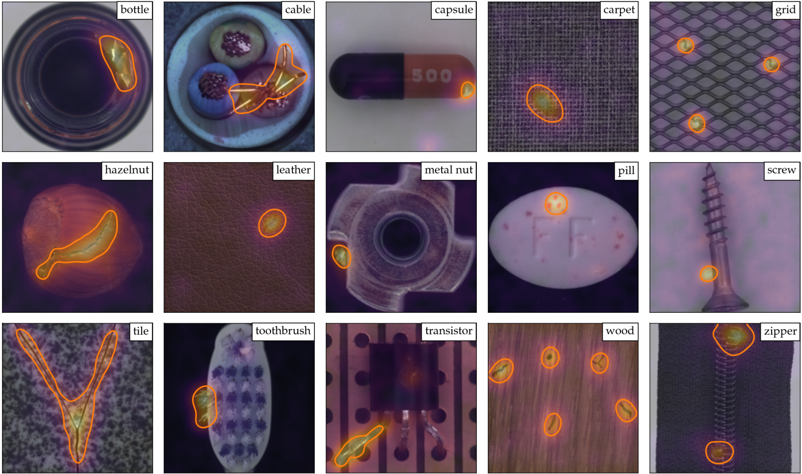
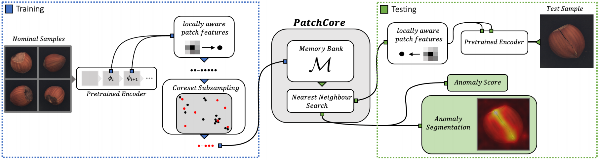

# Towards Total Recall in Industrial Anomaly Detection

This repository is based on the [official implementation](https://github.com/amazon-research/patchcore-inspection) for **PatchCore** as proposed in [Roth et al. (2021)](https://arxiv.org/abs/2106.08265), but has been adapted to my own needs.





---

## Setup Instructions

1. Clone this repository.

2. Run:
```
python -m pip install -r requirements.txt
```

3. Run:
```
python -m pip install timm
```

4. Define a `PYTHONPATH` environment variable to be, e.g., `C:\Users\your-name\Documents\Anomaly Detection\patchcore\src`.

5. In this repository, create a folder `datasets`, download the [MVTec AD](https://www.mvtec.com/company/research/datasets/mvtec-ad) and rename it to `mvtec`. Save your `mvtec` folder inside `datasets` and make sure that it follows the following data tree:
```
mvtec
|-- bottle
|-----|----- ground_truth
|-----|--------|-------- broken_large
|-----|--------|-------- ...
|-----|----- test
|-----|--------|-------- good
|-----|--------|-------- broken_large
|-----|--------|-------- ...
|-----|----- train
|-----|--------|-------- good
|-- cable
|-- ...
```

---

## Python and Anaconda with Git Bash

If you are working on Windows and want to use Python and Anaconda with Git Bash, you need to configure it by running the following command, for example:
```
cd
pwd

ls -l
ls -a

echo 'export PATH="../../ProgramData/Anaconda3:../../ProgramData/Anaconda3/Scripts:$PATH"' >> .bashrc
echo 'alias python="winpty python.exe"' >> .bashrc
source .bashrc
```

---

## Training PatchCore

To train PatchCore on the MVTec AD, run:
```
datapath=datasets/mvtec
datasets=('bottle' 'cable' 'capsule' 'carpet' 'grid' 'hazelnut' 'leather' 'metal_nut' 'pill' 'screw' 'tile' 'toothbrush' 'transistor' 'wood' 'zipper')
dataset_flags=($(for dataset in "${datasets[@]}"; do echo '-d '$dataset; done))

python bin/train_patchcore.py --gpu 0 --seed 0 --save_segmentation_images --save_patchcore_model --log_group IM224_WR50_L2-3_P01_D1024-1024_PS-3_AN-1_S0 --log_project MVTecAD_Results results patch_core -b wideresnet50 -le layer2 -le layer3 --faiss_on_gpu --pretrain_embed_dimension 1024 --target_embed_dimension 1024 --anomaly_scorer_num_nn 1 --patchsize 3 sampler -p 0.1 approx_greedy_coreset dataset --resize 256 --imagesize 224 "${dataset_flags[@]}" mvtec $datapath
```

For more sample trainings, see `sample_training.sh`.

---

## Evaluating PatchCore

To evaluate a pretrained PatchCore model, run:
```
datapath=datasets/mvtec
loadpath=results/MVTecAD_Results
modelfolder=IM224_WR50_L2-3_P01_D1024-1024_PS-3_AN-1_S0
savefolder=evaluated_results'/'$modelfolder

datasets=('bottle' 'cable' 'capsule' 'carpet' 'grid' 'hazelnut' 'leather' 'metal_nut' 'pill' 'screw' 'tile' 'toothbrush' 'transistor' 'wood' 'zipper')
dataset_flags=($(for dataset in "${datasets[@]}"; do echo '-d '$dataset; done))
model_flags=($(for dataset in "${datasets[@]}"; do echo '-p '$loadpath'/'$modelfolder'/models/mvtec_'$dataset; done))

python bin/infer_patchcore.py --gpu 0 --seed 0 --save_segmentation_images $savefolder patch_core_loader "${model_flags[@]}" --faiss_on_gpu dataset --resize 256 --imagesize 224 "${dataset_flags[@]}" mvtec $datapath
```

For more sample inferences, see `sample_inference.sh`.

---

## Citing

If you use the code in this repository, please cite:
```
@misc{roth2021total,
      title={Towards Total Recall in Industrial Anomaly Detection},
      author={Karsten Roth and Latha Pemula and Joaquin Zepeda and Bernhard Schölkopf and Thomas Brox and Peter Gehler},
      year={2021},
      eprint={2106.08265},
      archivePrefix={arXiv},
      primaryClass={cs.CV}
}
```

---

## License

This project is licensed under the Apache-2.0 License.
